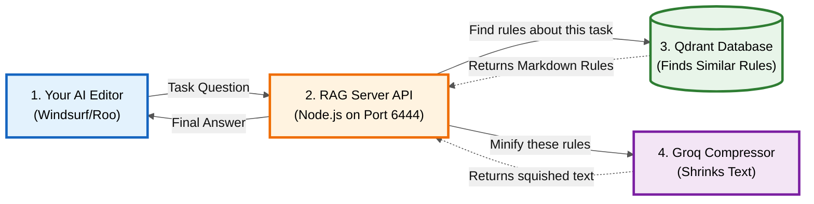

# 🧠 Senior Dev Mind — RAG Knowledge Base

A RAG (Retrieval Augmented Generation) system that stores your development rules, workflows, and templates in Qdrant for semantic search. Any AI agent (Ollama, Groq, Antigravity, Roo Code) can query it to get only the **relevant rules** for a given task — instead of loading everything into the prompt.

## Architecture

See **[rag_architecture.md](../.gemini/antigravity/brain/1ac3f303-88f9-4e45-94d5-3f8dcfcfd113/rag_architecture.md)** for detailed flow diagrams. The simplified flow is:

**AI Editor** → **RAG Server** → **Qdrant DB (Rules)** → **Groq (Compression)** → **AI Editor (Context)**

## Quick Start

```bash
# 1. Install dependencies
cd rag
npm install

# 2. Check system status
npm run status

# 3. Ingest knowledge base into Qdrant
npm run ingest

# 4. Query from CLI
npm run query -- "How should I structure a new feature?"
npm run query -- "booking API" --category rule
npm run query -- "debugging" --tags debugging --limit 10

# 5. Start the RAG server (for agent integration)
npm run serve
```

## WSL → Windows Ollama Access

If Ollama runs inside WSL, you must bind it to `0.0.0.0` so Windows can reach it:

```bash
# WSL Terminal 1
OLLAMA_HOST=0.0.0.0:11434 ollama serve
```

Then pull the embedding model (WSL Terminal 2):

```bash
ollama pull nomic-embed-text
```

Use the default `OLLAMA_URL=http://localhost:11434` in `.env`.
Windows will forward to WSL automatically when Ollama listens on `0.0.0.0`.

If localhost forwarding does not work, use the WSL IP instead:

```bash
# In WSL
hostname -I
```

Then set in `.env`:

```bash
OLLAMA_URL=http://<your-wsl-ip>:11434
```

## 🚀 Master Startup (Windows + WSL)

For one-click startup of the entire RAG stack (Ollama in WSL, RAG Server, and Sync Watcher), run the provided automation script from the project root:

```powershell
# Run the batch wrapper
.\scripts\start-rag-stack.bat
```

This script handles:
1. Starting Ollama in WSL with `0.0.0.0` binding.
2. Pulling the `nomic-embed-text` model.
3. Launching the RAG Server and Sync Watcher in separate terminal windows.

## 🌐 VPS / Production Deployment

When deploying to a Linux VPS (Ubuntu/Debian), use **native Linux services** (no WSL bridge needed):

1. **Ollama & Qdrant**: Run as systemd services or Docker containers.
2. **Process Management**: Use `pm2` to manage the Node.js application:
   ```bash
   # Start the Gateway
   pm2 start src/server.mjs --name "akrizu-gateway"
   
   # Start the Sync Watcher
   pm2 start src/sync.mjs --name "akrizu-sync" -- --watch
   ```
3. **Environment**: Ensure `.env` points to `localhost` or the Docker network IP for internal services.

## API Endpoints (Port 6444)

### `POST /search/text` — Search by natural language
```json
{
  "query": "How to create a booking endpoint?",
  "limit": 5,
  "category": "rule",
  "tags": ["backend", "api"]
}
```

### `POST /context` — Get LLM-ready context injection
```json
{
  "task": "Create REST endpoint for bookings",
  "limit": 3
}
```
Returns formatted context string ready to inject into any LLM prompt.

### `POST /search` — Search by pre-embedded vector
```json
{
  "vector": [0.1, 0.2, ...],
  "limit": 5
}
```

### `GET /health` — Health check
### `GET /stats` — Collection statistics

## 📖 Full Integration Guide

See **[GUIDE.md](./GUIDE.md)** for:
- Integration with **Antigravity, Cursor, Windsurf, Groq, Ollama, Roo Code**
- How to handle **changing rules, templates, and logs**
- Sync and re-ingest workflows
- API reference and daily startup checklist

## Commands

| Command | Description |
|---------|-------------|
| `npm run ingest` | Chunk, embed, and upsert all knowledge into Qdrant |
| `npm run query -- "text"` | Search from CLI |
| `npm run serve` | Start HTTP server for agent integration |
| `npm run status` | Check system health (Qdrant, Ollama, Groq) |
| `npm run reset` | Delete and recreate the collection |
| `npm run sync` | Full re-ingest (delete + rebuild) |
| `npm run sync:watch` | Watch for file changes and auto re-ingest |
| `npm run sync -- --file <path>` | Re-ingest a single file |

## Configuration (.env)

| Variable | Default | Description |
|----------|---------|-------------|
| `QDRANT_URL` | `http://localhost:6333` | Qdrant REST API URL |
| `QDRANT_COLLECTION` | `senior_dev_mind` | Collection name |
| `VECTOR_SIZE` | `768` | Embedding dimensions |
| `EMBEDDING_PROVIDER` | `ollama` | `ollama` or `groq` |
| `OLLAMA_URL` | `http://localhost:11434` | Ollama API URL |
| `OLLAMA_EMBED_MODEL` | `nomic-embed-text` | Embedding model |
| `GROQ_API_KEY` | — | Groq API key (fallback) |
| `RAG_SERVER_PORT` | `6444` | RAG server port |

## How It Works



1. **Chunking**: Each `.md` file in `.agent` is split by headers into independent sections.
2. **Embedding**: Before saving or searching, text is sent to **Ollama** (`nomic-embed-text`) to be converted into mathematical vectors.
3. **Storage**: Vectors + metadata are stored in **Qdrant**.
4. **Search**: The RAG server gets query strings from the AI agent and performs semantic similarity searches against Qdrant.
5. **Compression**: To save tokens, the raw markdown rules are sent to **Groq** to be summarized and minified.
6. **Context**: The `GET /context/compressed` endpoint returns formatted, token-efficient rules ready for LLM injection.
7. **Syncing**: The `sync.mjs` background watcher detects any changes to your `.agent` files and automatically updates Qdrant in real-time.

## Categories & Tags

### Categories
- `rule` — Coding standards, protocols, hard rules
- `workflow` — Step-by-step processes
- `template` — Code templates and examples
- `memory` — Feature analysis and project notes

### Auto-detected Tags
`backend`, `frontend`, `api`, `auth`, `database`, `debugging`, `mvvm`, `redux`,
`testing`, `security`, `admin`, `booking`, `performance`, `ui_ux`, `structure`, `scalability`
